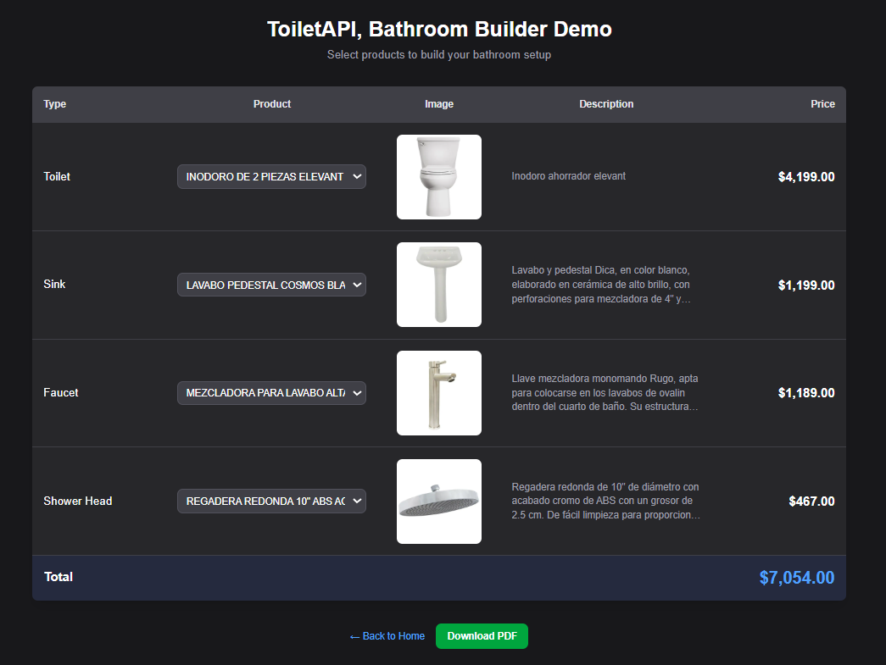

# ToiletPricerCLI

A web scraping tool with a REST API for extracting and serving bathroom product data from Home Depot Mexico. It scrapes product information, including prices, descriptions, specifications and images, for toilets, sinks, shower heads and faucets. Data is stored in a MySQL database and exposed through a Next.js API for easy integration with other applications. This project is inspired by a production project for which I contributed at RIAN Soluciones. 

The project includes an interactive **Bathroom Builder Demo** that allows users to select products from each category, view details and images, see a total price calculation, and download a PDF summary of their selection.

[Go to Installation](#installation)  -  [Go to QuickStart](#quick-start)

## Features

- Scrape product data from Home Depot Mexico
- Filter unwanted products based on configurable keywords
- Download product images automatically
- Store data in MySQL database
- Update existing products with fresh data
- **REST API** to query and retrieve product data with filtering support
- **Interactive Demo** to build a bathroom setup with product selection
- **PDF Export** to download selected products with images and details
- Support for multiple product categories:
  - Toilets (WC)
  - Sinks
  - Shower heads
  - Faucets

## Prerequisites

- Node.js (v18 or higher)
- npm
- MySQL Server (v8.0 or higher)

## Installation

1. Clone the repository:
   ```bash
   git clone https://github.com/yourusername/toiletapi.git
   cd toiletapi
   ```

2. Install dependencies:
   ```bash
   npm install
   ```

   [Go to QuickStart](#quick-start)


## Environment Setup

Create a `.env` file in the project root with the following variables:

```env
DB_HOST=localhost
DB_USER=root
DB_PASSWORD=your_password
DB_NAME=toiletapi
DB_PORT=3306
PORT=3000
```

| Variable | Description | Default |
|----------|-------------|---------|
| `DB_HOST` | MySQL server hostname | `localhost` |
| `DB_USER` | MySQL username | `root` |
| `DB_PASSWORD` | MySQL password | (empty) |
| `DB_NAME` | Database name | `my_app_db` |
| `DB_PORT` | MySQL port | `3306` |
| `PORT` | Development server port | `3000` |

## Database

### Schema

The `products` table stores all scraped product data:

| Column | Type | Description |
|--------|------|-------------|
| `id` | INT | Primary key, auto-increment |
| `name` | VARCHAR(255) | Product name |
| `price` | DECIMAL(10,2) | Original/base price |
| `price_alt` | DECIMAL(10,2) | Promotional/sale price |
| `color` | VARCHAR(50) | Product color |
| `description` | TEXT | Product description (max 300 chars) |
| `height` | DECIMAL(8,2) | Height dimension |
| `width` | DECIMAL(8,2) | Width dimension |
| `length` | DECIMAL(8,2) | Length dimension |
| `type` | VARCHAR(50) | Product category (wc, sink, faucet, shower-head) |
| `match_field` | VARCHAR(255) | Matched feature from filters |
| `image` | VARCHAR(500) | Relative path to downloaded image (`/media/{type}/{name}.jpg`) |
| `url` | VARCHAR(355) | Source URL |
| `created_at` | TIMESTAMP | Record creation time |
| `updated_at` | TIMESTAMP | Last update time |

## CLI Commands

Run commands using:
```bash
npm run cli -- <command> [options]
```

### Database Commands

#### `db:setup`
Setup the database and create tables.
```bash
npm run cli -- db:setup
```

#### `db:drop`
Drop the database.
```bash
npm run cli -- db:drop
```

### Scraping Commands

#### `fetch-links`
Fetch product links from Home Depot category pages.

```bash
npm run cli -- fetch-links [options]
```

| Option | Description | Default |
|--------|-------------|---------|
| `-l, --limit <number>` | Maximum links per category | 15 |
| `--no-filter` | Disable keyword filtering | filtering enabled |

#### `scrape`
Scrape product data from fetched links.

```bash
npm run cli -- scrape [options]
```

| Option | Description | Default |
|--------|-------------|---------|
| `-t, --test` | Test mode (only 5 products per category) | false |
| `-d, --database` | Save results to database | false |
| `--no-images` | Skip downloading product images | images enabled |

#### `update`
Update existing products in the database with fresh data.

```bash
npm run cli -- update [options]
```

| Option | Description | Default |
|--------|-------------|---------|
| `-d, --days <number>` | Update products not updated in X days (0 = all) | 0 |
| `--no-images` | Skip downloading product images | images enabled |

### Pipeline Commands

#### `set-up`
Run full pipeline: setup database, clean media, fetch links, scrape, and save to database.

```bash
npm run cli -- set-up [options]
```

| Option | Description | Default |
|--------|-------------|---------|
| `-t, --test` | Test mode (only 5 products per category) | false |
| `-l, --limit <number>` | Maximum links per category | 15 |
| `--no-images` | Skip downloading product images | images enabled |
| `--no-filter` | Disable keyword filtering | filtering enabled |

#### `set-up:fresh`
Drop database and run full pipeline from scratch.

```bash
npm run cli -- set-up:fresh [options]
```

Same options as `set-up`.

### Utility Commands

#### `clean-media`
Delete all contents of the media directory.

```bash
npm run cli -- clean-media
```

#### `run-server`
Kill any process on the server port, build the application, and start the development server.

```bash
npm run cli -- run-server [options]
```

| Option | Description | Default |
|--------|-------------|---------|
| `-p, --port <number>` | Port number | `PORT` env variable or `3000` |

**Note:** This command runs `npm run build` before starting the server to ensure the latest changes are compiled.

Examples:
```bash
# Run on default port (from .env or 3000)
npm run cli -- run-server

# Run on custom port
npm run cli -- run-server -p 4000
```

## Components

### Link Fetcher (`src/scraper/linkFetcher.ts`)

Fetches product links from Home Depot category pages.

**Process:**
1. Reads category URLs from `src/scraper/urls/baseUrls.json`
2. Loads filters from `src/scraper/config/filters.json` (if filtering enabled)
3. For each category, navigates through paginated results
4. Extracts product links from `a.styled--link-container` elements
5. Filters out links where anchor text contains any word from the category's `filter` array
6. Saves results to `src/scraper/urls/targetUrls.json`

### Product Scraper (`src/scraper/productScraper.ts`)

Scrapes detailed product data from individual product pages.

**Process:**
1. Reads links from `src/scraper/urls/targetUrls.json`
2. Loads feature config from `src/scraper/config/filters.json`
3. For each product URL:
   - Extracts product name from `<h1>` element
   - Parses price information (current price, original price)
   - Opens specifications drawer and extracts attributes (color, dimensions)
   - Extracts description from product page (capped at 300 characters)
   - Matches description against category features to set `match` field
   - Downloads product image (if enabled) using SKU-based URL construction
4. Optionally saves to database

**Image Download:**
- First attempts to construct URL from SKU: `https://cdn.homedepot.com.mx/productos/{SKU}/{SKU}-d.jpg`
- Falls back to searching page for images matching the CDN pattern
- Retries up to 5 times
- Images saved to `public/media/{category}/`

**Log File:**
- Each scraped product is logged to `scraper.log` in the project root
- Format: `{product name} scraped at {ISO timestamp}`
- Useful for tracking progress and debugging failed scrapes

### Update Products (`src/scraper/updateProducts.ts`)

Updates existing products in the database with fresh data.

**Process:**
1. Queries database for products to update (all or stale based on `days` option)
2. For each product, re-scrapes the product page
3. Updates all fields including price, description, attributes
4. Optionally re-downloads images (only updates image path if new image downloaded)

## API Endpoints

The application exposes REST API endpoints to access scraped data.

### `GET /api/toilet`

Returns all products from the database with optional filtering.

**Query Parameters:**

| Parameter | Description | Match Type |
|-----------|-------------|------------|
| `id` | Product ID | Exact |
| `type` | Product category (wc, sink, faucet, shower-head) | Exact |
| `match` | Feature match field | Exact |
| `color` | Product color | Partial (LIKE) |

**Examples:**
```bash
# Get all products
GET /api/toilet

# Get product by ID
GET /api/toilet?id=5

# Get all toilets
GET /api/toilet?type=wc

# Filter by type and match
GET /api/toilet?type=wc&match=alargado

# Filter by color (partial match)
GET /api/toilet?color=blanco

# Combine multiple filters
GET /api/toilet?type=faucet&color=cromado
```

**Response:**
```json
{
  "message": "Found 10 products",
  "count": 10,
  "query": { "id": null, "type": "wc", "match": null, "color": null },
  "products": [...]
}
```

### `GET /api/toilet/links`

Returns base URLs and target URLs for all categories.

**Query Parameters:**

| Parameter | Description |
|-----------|-------------|
| `type` | Filter by category (wc, sink, faucet, shower-head) |

**Examples:**
```bash
# Get all URLs
GET /api/toilet/links

# Get URLs for specific category
GET /api/toilet/links?type=wc
```

**Response:**
```json
{
  "message": "Found 4 categories with 60 target links",
  "baseUrls": { "urls": { "wc": "https://...", ... } },
  "targetUrls": { "urls": { "wc": ["...", "..."], ... } },
  "summary": {
    "categories": 4,
    "totalTargetLinks": 60,
    "linksPerCategory": { "wc": 15, "sink": 15, ... }
  }
}
```

## Configuration Files

### `src/scraper/urls/baseUrls.json`

Defines category URLs to scrape:

```json
{
  "urls": {
    "wc": "https://www.homedepot.com.mx/b/banos/sanitarios-y-accesorios/sanitarios-de-dos-piezas",
    "shower-head": "https://www.homedepot.com.mx/b/banos/regaderas-y-accesorios/regaderas-5722-107-26",
    "faucet": "https://www.homedepot.com.mx/s/mezcladorA",
    "sink": "https://www.homedepot.com.mx/b/banos/muebles-para-bano-y-lavabos/lavabos-y-ovalines"
  }
}
```

<small>You may add another link but the scraping won't work as intended unless a filter is added too</small>

### `src/scraper/config/filters.json`

Defines filters and features for each category:

```json
{
  "wc": {
    "filter": ["tanque", "paquete", "kit", "taza"],
    "feature": ["redondo", "redonda", "alargado", "alargada"],
    "default": "redondo"
  }
}
```

| Field | Description |
|-------|-------------|
| `filter` | Words that exclude a product if found in link text |
| `feature` | Words to search in description for `match` field |
| `default` | Default value for `match` if no feature found |

## Demo Page

The application includes an interactive demo at `/demo` that showcases the scraped product data.



### Features

- **Product Selection**: Choose one product from each category (Toilet, Sink, Faucet, Shower Head)
- **Live Preview**: View product image, name, description, and price for each selection
- **Price Calculation**: Automatic total price calculation for all selected products
- **PDF Download**: Export your selection as a single-page PDF document

### PDF Export

The "Download PDF" button generates a PDF containing:

- Product image (embedded)
- Product name
- Current price (and original price if on sale)
- Color
- Description (truncated)
- Direct link to Home Depot product page
- Total price for all selected products

### Usage
1. Set up your database (Skip if already done):
   ```bash
   npm run cli -- set-up:fresh -t -l 5
   ```
   > **Note:** You don't need to scrap and download the images to safely use the demo, a placeholder will take it's place if the images are missing. You can add  `--no-images`  to the set up command to skip the image download process entirely. 

2. Start the server:
   ```bash
   npm run cli -- run-server
   ```

3. Navigate to `http://localhost:3000/demo`

4. Select products from each category dropdown

5. Click "Download PDF" to export your selection


## Quick Start
[Go to Installation](#installation)

1. Setup environment:
   ```bash
   cp .env.example .env
   # Edit .env with your MySQL credentials
   ```

2. Run fresh setup with test mode:
   ```bash
   npm run cli -- set-up:fresh -t -l 5
   ```

3. Run full scrape:
   ```bash
   npm run cli -- set-up:fresh -l 20
   ```

## License

MIT
